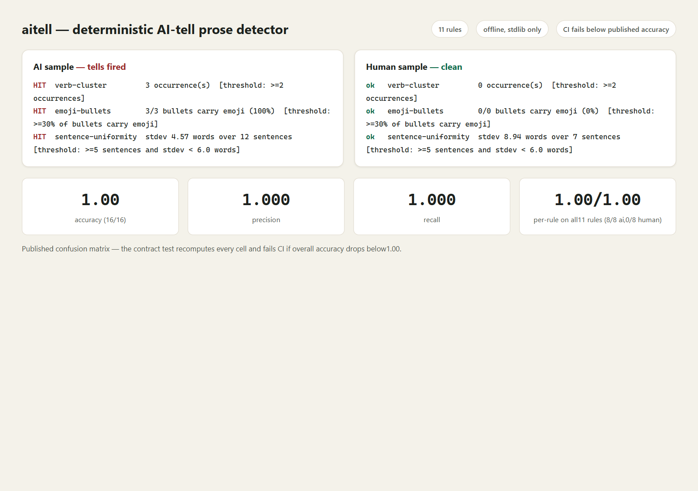
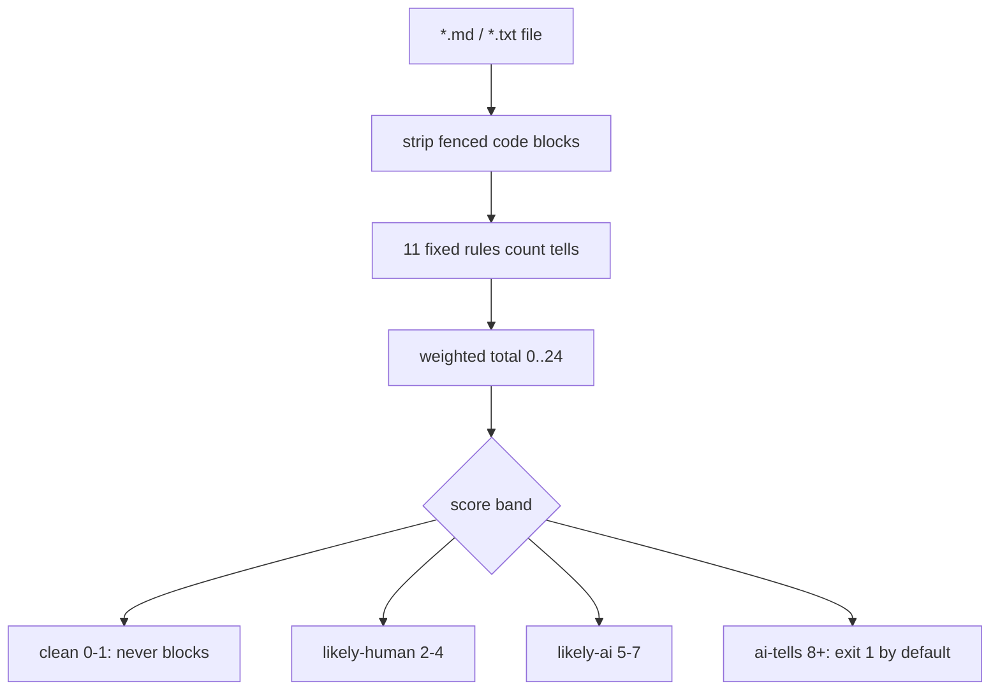

# aitell

**Prose that reads machine-polished is a build failure - `aitell` counts the tells.** Eleven deterministic pattern-count rules plus a weighted score mapped to `clean`/`likely-human`/`likely-ai`/`ai-tells` bands (full catalogue in [references/RULES.md](references/RULES.md)). No model reads your words, no network, no telemetry.

[](https://github.com/F0Rextasy/aitell/actions/workflows/test.yml)
[](https://www.python.org/)
[](#what-it-will-never-do)
[](https://skills.sh/F0Rextasy/aitell)
[](LICENSE)



## Why this exists

A docs page goes out stuffed with tells -- "Let's explore", three em-dashes per paragraph, lists that always arrive in threes, a closing summary restating the obvious -- and nobody notices when the voice flattened, because each tell is invisible alone. Asking a model to judge prose is slow and non-deterministic, and ships your draft to a prompt. Counting is a solved problem: this is regex-and-arithmetic work that belongs in CI, in milliseconds, next to your linter.

AI-style tells, NOT proof of authorship: a band says the text *looks like* common LLM output, never who wrote it. A human imitating the pattern trips every rule; a machine writing plainly trips none.

## Quick start
```bash
# install the skill into any agent (Claude Code, Codex, Cursor, OpenCode, ...):
npx skills add F0Rextasy/aitell

# or run it directly:
git clone https://github.com/F0Rextasy/aitell
python aitell/scripts/aitell README.md posts/ --no-color
```

| Exit | Meaning |
| --- | --- |
| `0` | every file below `--fail-over` (default `ai-tells`) |
| `1` | a file reached the gate band - rewrite or acknowledge |
| `2` | usage error |

`--fail-over likely-ai` (or `likely-human`) catches earlier drafts; `--format json` for machines. Fenced code blocks are stripped before analysis, so samples never count as prose.

## How a file is judged



Weights live in the script header: three rules count 3, most count 2, one counts 1 (see [references/RULES.md](references/RULES.md)). Every density rule has a count floor (a lone dash or triplet never fires alone).

## Evidence (real output)

`examples/corpus/ai/notes-01.md` -- a synthetic sample stuffed with all eleven tells -- scores 24, every rule firing with its measured value:

```console
$ python scripts/aitell examples/corpus/ai/notes-01.md --no-color
== examples/corpus/ai/notes-01.md: AI-TELLS (score 24)
  HIT  delve                1 occurrence(s)  [threshold: >=1 occurrence]
  HIT  conclusion           1 occurrence(s)  [threshold: >=1 occurrence]
  HIT  moreover-opener      1 paragraph(s) open with moreover/furthermore  [threshold: >=1 paragraph opener]
  HIT  emdash-density       2.04 per 100 words (3 in 147 words)  [threshold: >1.0 per 100 words and >=2 dashes]
  HIT  triplet              4 triplet(s)  [threshold: >=2 ', X, and Y' triplets]
  HIT  notjust              1 occurrence(s)  [threshold: >=1 occurrence]
  HIT  divein               1 occurrence(s)  [threshold: >=1 occurrence]
  HIT  boldheaders          2 fully-bold line(s)  [threshold: >=2 fully-bold lines]
  HIT  verb-cluster         3 occurrence(s)  [threshold: >=2 occurrences]
  HIT  emoji-bullets        3/3 bullets carry emoji (100%)  [threshold: >=30% of bullets carry emoji]
  HIT  sentence-uniformity  stdev 4.57 words over 12 sentences  [threshold: >=5 sentences and stdev < 6.0 words]

aitell: 1 file(s), 1 flagged ai-tells
[exit 1]
```

`examples/corpus/human/tap-01.md` -- a self-authored note about fixing a tap -- scores 0, every rule quiet (its single dash stays under the >=2 floor):

```console
$ python scripts/aitell examples/corpus/human/tap-01.md --no-color
== examples/corpus/human/tap-01.md: CLEAN (score 0)
  ok   delve                0 occurrence(s)  [threshold: >=1 occurrence]
  ok   conclusion           0 occurrence(s)  [threshold: >=1 occurrence]
  ok   moreover-opener      0 paragraph(s) open with moreover/furthermore  [threshold: >=1 paragraph opener]
  ok   emdash-density       1.02 per 100 words (1 in 98 words)  [threshold: >1.0 per 100 words and >=2 dashes]
  ok   triplet              0 triplet(s)  [threshold: >=2 ', X, and Y' triplets]
  ok   notjust              0 occurrence(s)  [threshold: >=1 occurrence]
  ok   divein               0 occurrence(s)  [threshold: >=1 occurrence]
  ok   boldheaders          0 fully-bold line(s)  [threshold: >=2 fully-bold lines]
  ok   verb-cluster         0 occurrence(s)  [threshold: >=2 occurrences]
  ok   emoji-bullets        0/0 bullets carry emoji (0%)  [threshold: >=30% of bullets carry emoji]
  ok   sentence-uniformity  stdev 8.94 words over 7 sentences  [threshold: >=5 sentences and stdev < 6.0 words]

aitell: 1 file(s), 0 flagged ai-tells
[exit 0]
```

## Confusion matrix (published, enforced in CI)

The harness scans the committed labeled corpus -- 8 synthetic AI-style samples under `examples/corpus/ai/` (each stuffed with all eleven tells) and 8 self-authored human notes under `examples/corpus/human/` (everyday topics, deliberately plain) -- at the shipped thresholds, raw JSON in `examples/results/matrix.json`:

| | predicted ai-tells | predicted clean |
| --- | --- | --- |
| actual ai (8) | TP = 8 | FN = 0 |
| actual human (8) | FP = 0 | TN = 8 |

Accuracy **1.00 (16/16)**, precision **1.000**, recall **1.000**. Per-rule precision/recall is **1.00/1.00 on all eleven rules** (each fires 8/8 on ai, 0/8 on human). The contract test `test_confusion_matrix_matches_published_numbers` recomputes every cell and fails CI if overall accuracy drops below 1.00.

This corpus is small and synthetic by design -- a smoke-level sanity check that the shipped thresholds separate the two piles, not a benchmark. Real prose sits between these extremes; the bands exist for exactly that middle.

Contract tests, 18 for 18:

```console
$ python -m unittest discover -s tests -v
..................
----------------------------------------------------------------------
Ran 18 tests in 1.673s

OK
[exit 0]
```

## Wire it into CI

```yaml
- uses: actions/checkout@v4
- uses: actions/setup-python@v5
  with:
    python-version: "3.12"
- name: prose still sounds human
  run: python aitell/scripts/aitell README.md posts/ --fail-over ai-tells --no-color
```

This repository dogfoods it: CI scans its own `README.md`, `SKILL.md`, and `references/` with `--fail-over ai-tells` on every push -- and asserts the ai corpus sample still flags.

## What it will never do

- Call a band proof of who wrote the text -- tells are style signals, and a human imitating the pattern trips every rule on purpose.
- Paste prose into a model to "check" it -- that is this repo's whole reason to exist.
- Phone home, fetch models, or need keys -- stdlib only, offline, deterministic: same bytes, same band, same exit code.
- Fire on a single dash, triplet, or bold line -- every density rule has a count floor, and the floors are published above.

## How it compares

*Caption: AI-prose detectors -- only ours and unslop-check give checkable numbers without sending text anywhere.*

|tool|install|offline?|quality/precision metric|license/key-caveat|
|---|---|---|---|---|
|**aitell** (ours)|`npx skills add F0Rextasy/aitell`|Yes|Published confusion matrix; deterministic score|Deterministic -- same input, same verdict, every run|
|**ai-detect**|`git clone github.com/houtini-ai/ai-detect && pip install .` (not on PyPI)|Yes, after 1.7 GB one-time model download (126 MB light)|Model RAID #1 backing + paired 92.6% vs 0.03%; no own P/R table|MIT (beta); pulls torch/transformers|
|**unslop-check**|`npm i -g unslop-check` (Node >=18)|Yes (pure stylometry, no model)|7 signals 0-1 + composite; calibration FPR floor 0.4% -- distilled from unslop.run, not self-measured|MIT; reference data, not tool-measured precision/recall|
|**SaaS (GPTZero)**|Web/API -- no offline CLI|No|Vendor-claimed accuracy only, unverifiable locally|Proprietary/paid; text leaves the machine (NDA risk)|

## One path, many gates — the family

Deterministic gates - one Python script each, stdlib, same exit contract:

| Repo | What its verdict means |
| --- | ---|
| [dsh-gate](https://github.com/F0Rextasy/dsh-gate) | the shell session actually ran - real commands, real files, real log |
| [sessionaudit](https://github.com/F0Rextasy/sessionaudit) | the session behaved - scope, secrets, destructive acts, self-contradicted claims |
| [cigate](https://github.com/F0Rextasy/cigate) | the workflows burn each minute once - pins, path filters, dedup, budget |
| [ci-triage](https://github.com/F0Rextasy/ci-triage) | one log, one verdict: regression / flaky / infra / pass |
| [docproof](https://github.com/F0Rextasy/docproof) | every README doc snippet is runnable, parsed, and verified in CI |
| [preflight](https://github.com/F0Rextasy/preflight) | the config is safe to ship - semantics, not syntax |
| [prove-it](https://github.com/F0Rextasy/prove-it) | every claim in this README is backed by real, captured output |
| [shipcheck](https://github.com/F0Rextasy/shipcheck) | the artifacts in `dist/` match `src/` - nothing stale ships |
| [testgate](https://github.com/F0Rextasy/testgate) | the tests that ran are the tests that exist - gaps, dupes, skips |
| [bandaid](https://github.com/F0Rextasy/bandaid) | the diff doesn't hide a silent failure - swallowed errors, dead guards |
| [wincompat](https://github.com/F0Rextasy/wincompat) | every path in the tree survives a Windows checkout |
| [compressproof](https://github.com/F0Rextasy/compressproof) | the context shrank without losing an answer - reversible compression, byte proof, answer-equivalence oracle |
| [uigate](https://github.com/F0Rextasy/uigate) | the UI stops looking like the same AI slop - measurable design-slop lint, WCAG + template tells |
| [aitell](https://github.com/F0Rextasy/aitell) | the prose stops reading as AI - deterministic AI-tell detection with a published confusion matrix |
| [route-drift](https://github.com/F0Rextasy/route-drift) | OpenAPI spec vs code routes drift gate |

## License

[MIT](LICENSE)
